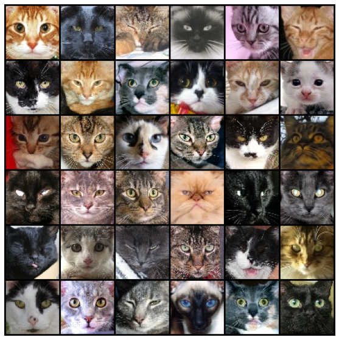
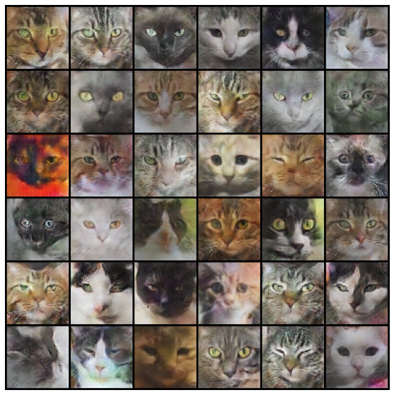

# Cat faces generator

This repository present a neural network trained to generate cat faces.

I used a [DCGAN](https://arxiv.org/abs/1511.06434) Network on a dataset of [15747 cat faces](https://www.kaggle.com/datasets/spandan2/cats-faces-64x64-for-generative-models). This method use two networks trained together and in competition with each other. The first network is a discriminator trained to distinguish real cat faces from the dataset and generated faces. The second network is a generator, trained to generate cat faces and to trick the discriminator.

Here are some real cat faces from the dataset:

And here are some fake cat faces generated by the network:

